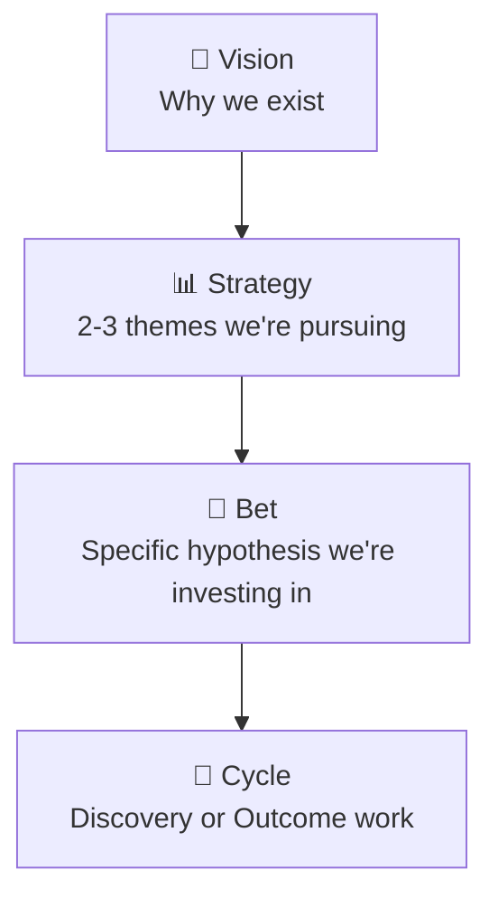
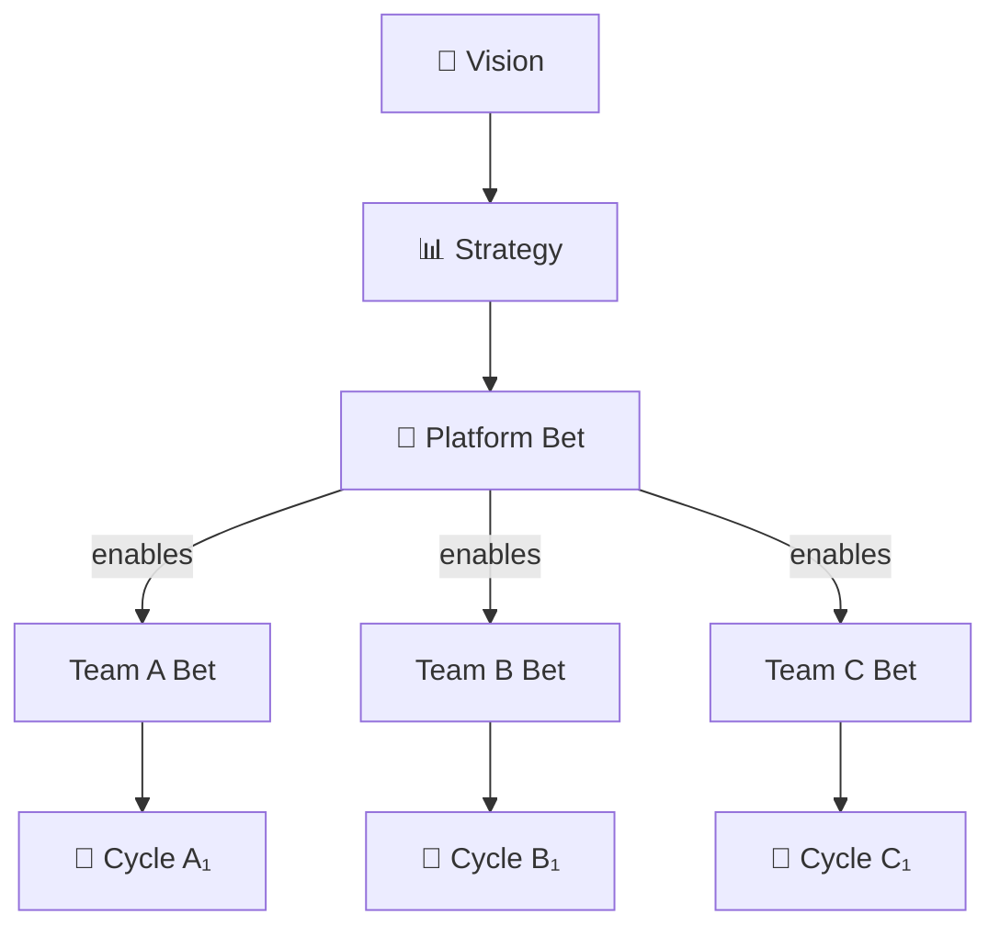

> Part I: Foundation | [← Previous](02-mental-model.md) | [Next →](04-first-cycle.md)

# Chapter 3: The Decision Spine

> *Panel-reviewed: Meeting #2 (2026-03-19) — 9 agree, 2 modify-accept*
> **Read this**: Everyone. The spine is foundational to all FLOW decisions.

---

## The Traceability Chain

Every piece of work in FLOW traces upward through four levels:

```
Vision → Strategy → Bet → Cycle
```

**Vision**: Why does this product/team/company exist? What future are we creating?
**Strategy**: Given that vision, what are the 2-3 strategic themes we're pursuing right now?
**Bet**: Within a strategy, what specific hypothesis are we investing in? What do we believe will move us forward?
**Cycle**: The concrete work — a Discovery cycle (learning) or an Outcome cycle (shipping) — that executes on a bet.



The spine is your **bullshit detector**. It answers one question: **"Can you explain why this work exists by tracing it upward to something strategic?"**

If you can't trace this cycle to a bet, and that bet to a strategy, and that strategy to the vision — the work probably shouldn't exist. Not because it's bad work, but because nobody can explain why it matters more than the hundred other things the team could be doing. The spine forces that conversation in 30 seconds, not 30 meetings.

---

## Why "Bet"

The word "Bet" is intentional.

A bet is not a guarantee. It's not a commitment. It's not a promise. It's a statement of belief backed by reasoning: "We believe X will happen if we do Y, and here's why." The language reminds everyone — leadership included — that **we might be wrong.**

This intellectual honesty enables kill conditions. If the bet were called a "commitment," stopping would feel like breaking a promise. If it's called an "initiative," it sounds permanent. "Bet" carries the psychological weight of uncertainty. It's a feature, not a bug.

> **For formal contexts**: Government, banking, and enterprise organizations may prefer different language. "Investment Hypothesis" carries the same meaning without the gambling connotation. "Strategic Initiative" works if the team commits to treating it as falsifiable. The semantics are the same — use the language your organization will adopt. What matters is that the concept remains **killable**. If changing the word makes it unkillable, keep "Bet."

---

## Spine Mapping in Practice

Spine mapping exists on a spectrum. The right level of formality depends on your context:

### Informal / Mental (Solo Founders, Tiny Teams)
Carlos doesn't have a strategy document. But he has a spine:
- **Vision**: Build a sustainable solo software business
- **Strategy**: Code review tools are underserved — build the best AI-powered one
- **Bet**: Developers will pay for automated PR reviews if accuracy exceeds 80%
- **Cycle**: Ship the accuracy benchmark feature this week, measure conversion

He carries this trace in his head. He's never written it down. But when someone asks "why are you building this feature?" he can answer by tracing upward. That's a valid spine.

For solo founders: write your spine once on a sticky note. Update it when it changes. You don't need a governance framework — you need clarity about WHY.

### Team-Owned (Small Teams, 3-15 People)
The PM writes the spine mapping for each bet. The team reviews it at cycle kickoff:
- "This cycle traces to Bet: 'Nurses will adopt scheduling if we reduce clicks by 50%' which traces to Strategy: 'Win Hospital X renewal' which traces to Vision: 'Every hospital runs on MedFlow.'"

Takes 5 minutes at cycle start. Keeps the team connected to purpose.

### PM-Owned, Leadership-Reviewed (Mid-Size Teams, 15-50 People)
The PM maintains a spine document. Leadership reviews it quarterly (or at PI Planning cadence). Bets are discussed and approved before cycles start. Kill conditions are reviewed at Kill/Merge meetings.

### Leadership-Owned, Governance-Gated (Enterprise, 50+ People)
Strategy is set by leadership. Bets are proposed by PMs and approved by a portfolio governance body. Spine alignment is checked at formal review points. Changes to strategy require executive sign-off.

### Governance-Gated (Government, Regulated Industries)
Spine maps to the national/regulatory planning hierarchy:
- **Vision** → National Vision (e.g., Qatar National Vision 2030)
- **Strategy** → Sector Strategy (e.g., Digital Transformation of Citizen Services)
- **Bet** → Program Investment (e.g., Citizen Services Portal — Phase 2)
- **Cycle** → Project Deliverable (e.g., Online Business License Application)

The level of approval required for mode transitions depends on the organization's **delegation of authority**. Some transitions may be approved by the program manager; others require board-level sign-off. Evidence packages are formal documents. The spine is auditable.

---

## Admission Control

The default rule: **nothing enters active development without a valid spine trace.**

When a new request arrives (via intake, [Chapter 4](05-intake.md)), the first check is: "Does this trace to an active bet, which traces to an active strategy?" If yes, it enters the system. If no, it goes back to intake for classification — or it gets rejected.

This sounds strict. It is. But it solves one of the most common product failures: teams working on things that don't connect to anything strategic. The "CEO's pet project" that nobody can explain. The "tech debt cleanup" that never links to a business outcome. The "quick favor for Sales" that eats 3 weeks.

Admission control gives PMs a legitimate tool to say no: *"I'd love to help, but this doesn't trace to any of our active bets. Can you help me understand which strategy it supports?"*

### The Operational Exception

Not all work traces to a bet. Production incidents, critical bugs, infrastructure failures — these are **operational work** that bypasses the spine. The system is down. Customers are affected. You don't pause to check spine mapping.

FLOW acknowledges this explicitly: operational/incident work is exempt from admission control. But it should be tracked separately and reviewed during rituals. If operational work consistently consumes more than 20% of team capacity, that's a signal — either the system has quality problems (a bet in itself) or the team is using "operational" as a label to bypass the spine.

---

## Platform Spine Topology

Not every team ships features directly to end users. Platform teams, infrastructure teams, and enabling teams have a different spine topology:



A platform bet doesn't produce user-facing value directly. It **enables** other teams' bets. The spine branches after the platform bet.

Example: Liam's API platform team.
- **Vision**: Every developer can build real-time data pipelines in minutes
- **Strategy**: Make our API the most reliable and developer-friendly in the market
- **Platform Bet**: "If we add streaming support to the v3 API, 3 downstream teams can ship real-time features"
- **Enables**: Team A (real-time dashboards), Team B (alerting), Team C (live data export)

The platform bet's kill condition is different from a product bet. A product bet kills based on user metrics. A platform bet kills based on **downstream adoption**: "If fewer than 2 of the 3 enabled teams actually use the streaming API within 4 weeks of launch, we kill or redesign."

**Cascade effect**: Killing a platform bet requires communicating with all dependent teams. Their bets may need to be revised, paused, or killed as a consequence. This is why platform kill decisions carry more organizational weight — they're not one team's decision, they're a portfolio event.

---

## Mapping Your Hierarchy

Many organizations have more than four levels. That's fine. Map downward to the FLOW spine:

### Enterprise Example (6 levels → 4)

| Your Hierarchy | FLOW Spine |
|---------------|------------|
| Enterprise Vision | **Vision** |
| Business Unit Strategy | **Strategy** |
| Program | *Strategy* (a program is a strategic theme) |
| Initiative | **Bet** |
| Project | **Bet** (a project is an investment hypothesis) |
| Work Package | **Cycle** |

The key: Programs collapse into Strategy. Projects and Initiatives collapse into Bet. The spine stays at four levels.

### Solo Example (3 levels → 4)

| Your Reality | FLOW Spine |
|-------------|------------|
| "I want to make a living from software" | **Vision** |
| "Code review tools are hot" | **Strategy** |
| *(no explicit bet — you just build)* | **Bet** (make it explicit: "developers will pay for AI reviews") |
| "Ship this feature" | **Cycle** |

The key: Solo founders often skip the Bet level. Making it explicit forces the question: "Why THIS feature and not the 10 others on my list?"

### Hardware Startup Example (Emerging Market)

| Level | Spine |
|-------|-------|
| **Vision** | Electricity for every rural community |
| **Strategy** | Low-cost solar micro-grids with mobile payment |
| **Bet** | Village Kisumu will adopt at $3/month if we pre-install in the chief's house first |
| **Cycle** | Discovery — interview 20 households about willingness to pay |

The key: In hardware, bets carry manufacturing risk. Each bet must pass Discovery before any physical prototype is built. The spine keeps the team from jumping to a $5,000 prototype before validating demand with a $50 conversation.

### Agency Example (Partial Spine)

| Boundary | Level | Owner |
|----------|-------|-------|
| Client-owned | **Vision** | Client's CEO/leadership |
| Client-owned | **Strategy** | Client's product team |
| Shared | **Bet** | Negotiated between client PO and agency PM |
| Agency-owned | **Cycle** | Agency delivery team |

The key: The spine is split across organizational boundaries. The agency PM's job is to ensure that Bet and Cycle trace upward to the client's Strategy — even when the client doesn't make their strategy explicit. Sometimes the PM must **construct the upper spine** from conversations:

*A client says "just build us an app." There's no strategy document. But from the kickoff, you learn: they want to capture under-25 users before a competitor launches. You construct: Vision = "Be the go-to platform for Gen Z in our market." Strategy = "Launch a mobile-first experience before Competitor X." Now you have a spine to trace your bets against — and a way to push back when the client asks for a desktop admin panel that doesn't connect to anything.*

---

## Maintaining the Spine

Strategy changes. Bets fail. Visions evolve. The spine is a living structure.

**When strategy shifts**: Review all active bets. Do they still trace? Kill the ones that don't. Reallocate cycles to bets that align with the new strategy.

**When a bet fails**: Kill its cycles. Archive the learnings ([Chapter 7](08-discovery-decisions.md) or [11](12-outcome-decisions.md)). Free capacity for new bets.

**When vision evolves**: This is rare but happens (pivots, acquisitions, leadership change). When it does, the entire spine is reviewed from top to bottom. This is a significant organizational event — not a Tuesday afternoon decision.

**Quarterly spine review**: At minimum, review the full spine quarterly. Are the strategies still right? Are the bets still alive? Are cycles connecting? A healthy spine has 2-4 active strategies with 3-8 active bets total. More than that signals WIP problems ([Chapter 12](13-wip-limits.md)).

---

## Bet Prioritization

When multiple bets trace to the same strategy, how do you choose which to pursue first?

**The principle: cheapest experiment first.** Start with the bet whose Discovery experiment is fastest and cheapest to run. If it dies, you've lost minimal time and can move to the next. If it lives, you've validated quickly and can commit to Outcome.

This maximizes **learning velocity per dollar spent** — the same principle as the experiment hierarchy ([Chapter 6](07-experiments.md)) applied to portfolio-level decisions.

**Four prioritization factors** (weight varies by context):
1. **Cheapest experiment** (default) — which bet can we validate fastest?
2. **Strategic importance** — does leadership consider one bet more critical?
3. **Urgency** — is there a deadline, a competitor move, or a regulatory window?
4. **Readiness** — does the team have the skills and capacity to execute?

In government and enterprise, strategic importance and urgency often outweigh cheapest experiment. In startups, cheapest experiment wins almost always — because you're optimizing for learning speed, not organizational alignment.

---

*Next: [Chapter 4 — Your First FLOW Cycle →](04-first-cycle.md)*
