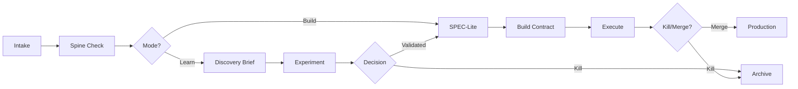

> Bridge: Theory → Practice | [← Previous](03-decision-spine.md) | [Next →](05-intake.md)

# Chapter 4: Your First FLOW Cycle — A Complete Walkthrough

> *Added after Meeting #10 (2026-03-19) — unanimous panel request*
> *Updated: Meeting #14 — Transition Markers, Cycle State*
> **Read this**: Everyone — this is your first hands-on FLOW experience.



---

This chapter walks through one complete FLOW cycle from intake to Kill/Merge decision. Two versions: a quick walkthrough for small teams, and a detailed walkthrough for enterprise. Both follow the same steps — the formality scales.

---

## Quick Walkthrough (Solo / Small Team — 30 minutes to read)

### The Scenario
Carlos is a solo founder building Codeflow, an AI code review tool. A user on Discord says: "I wish your tool could summarize entire PRs, not just review line-by-line."

### Step 1: Intake (2 minutes)
Carlos thinks: "Is this Discovery or Outcome?"
- Do I have evidence that users want PR summaries? **No — just one Discord message.**
- Have I tested this before? **No.**
- → **Discovery mode.** Write a minimum Brief.

### Step 2: Spine Check (1 minute)
- **Vision**: Build the best AI code review tool
- **Strategy**: Expand from line-by-line review to full-PR intelligence
- **Bet**: "Developers will pay for AI-generated PR summaries"
- Does this trace? **Yes — it's a new bet under an existing strategy.**

### Step 3: Discovery Brief — 3-Field Minimum (5 minutes)
```
Hypothesis: Developers on teams of 5-20 will enable auto-PR-summaries
            if summaries save >5 min per PR review.

Kill Condition: If fewer than 5 of 20 beta users enable auto-summaries
               after 1 week, kill.

Experiment: Build a basic summary feature. Offer free to 20 beta users
           from Discord community for 1 week. Track daily enable/disable.
```

### Step 4: Gate D1 Check (2 minutes, mental)
- ✅ Hypothesis is falsifiable (can measure enables)
- ✅ Kill condition is specific (5 of 20, 1 week)
- ✅ Experiment is designed (beta release, track metric)
- ✅ Cheapest valid option? Could he do conversations first? **Possible, but for a developer tool, the actual experience matters more than stated preferences. Building a basic version takes 6 hours. Valid.**
- ✅ Spine traces
- **D1 passes.**

### Step 5: Run the Experiment (6 hours building + 7 days measuring)
Carlos builds a basic PR summary feature. Ships to 20 beta users on Monday.

**Experiment Log Entry:**
```
Date: Monday
Hypothesis: Developers will enable auto-PR-summaries
Type: Limited build (collapsed mode — building IS the experiment)
Cost: 6 hours of development time
What happened: 2 of 20 users enabled summaries by Wednesday.
              3 others tried it and disabled it.
              Feedback: "Too verbose. I wanted a 2-sentence summary, not 3 paragraphs."
What we learned: The concept has interest (5 tried it) but the execution
                is wrong (too verbose). The problem is real but the solution
                needs refinement.
Decision: REFINE
Next action: Hypothesis stays. Revise to test 2-sentence summaries.
```

### Step 6: Decision — Refine (not Kill)
Kill condition: "fewer than 5 of 20 enable after 1 week."
Result: 2 enabled, 3 tried-and-disabled. Kill condition IS triggered (< 5 enables).

**30-minute inspection**: Was the kill condition fair? Carlos reviews: 5 people tried the feature. 3 disabled it because it was too verbose, not because they didn't want summaries. The DATA suggests the problem is real (people tried it) but the EXECUTION is wrong (too much text).

**Decision**: REFINE, not Kill. Revised hypothesis: "Developers will enable 2-sentence summaries." New kill condition: "If fewer than 8 of 20 enable the revised version in 1 week, kill." Stricter condition, shorter version.

### Step 7: Second Experiment → Kill or Proceed
Carlos ships 2-sentence summaries. After 1 week: 12 of 20 enabled. Kill condition NOT triggered. Success signal reached.

**Gate D3**: Enough evidence to move to Outcome? **Yes.** The problem is real (developers want PR summaries), the approach works (2-sentence format), adoption exceeds threshold.

### Step 8: SPEC-Lite (5 minutes)
```
Problem: Developers on teams of 5-20 want AI-generated PR summaries
        (validated: 12/20 beta users enabled 2-sentence version)

Scope: Full PR summary feature — 2-sentence format, toggleable per repo,
       visible in PR description and Slack notification

Target Metric: 40% of active users enable summaries within 30 days of launch

Kill Condition: If fewer than 25% enable within 2 weeks, kill

Non-Goals: Customizable summary length, summary of commit history,
          integration with non-GitHub platforms
```

### Step 9: Build, Measure, Kill/Merge
Carlos builds the full feature (collapsed mode — he's solo, no Build Contract needed). Ships. Measures. After 2 weeks: 38% enabled. Close to threshold. **Continue** — give it one more week. After 3 weeks: 44%. Threshold exceeded. **Merge.** Feature is permanent.

**Total time from Discord message to shipped feature: 4 weeks.**
**Without FLOW: Would have built full feature immediately (2 weeks), no kill condition, no measurement. If adoption was 5%, he'd never know — and he'd maintain it forever.**

---

## Detailed Walkthrough (Enterprise — 15 minutes to read)

### The Scenario
Priya is Head of Product at MedFlow Solutions. Hospital X requests a shift-swap feature for nurses. 15-person team, 2 squads.

### Step 1: Intake + Shaping (Day 1)
Request arrives from Hospital X's nursing director: "Our nurses waste time coordinating shift swaps on WhatsApp."

**Shaping** (Priya + Tech Lead, 30 minutes):
- **Boundary**: Shift swaps only. Not shift creation, not schedule management, not overtime tracking.
- **Risk**: Do nurses actually want a digital tool, or is WhatsApp "good enough"?
- **Mode**: Risk is "build the wrong thing" → **Discovery mode.**

**Spine check**:
- Vision: Every hospital runs on MedFlow
- Strategy: Win Hospital X contract renewal
- Bet: "Nurses will adopt shift-swap if we reduce coordination time by 50%"
- **Traces? Yes.** New bet under existing strategy.

### Step 2: Discovery Brief — 5-Field Full (Priya + BA, 2 hours)
```
Problem Statement: Nurses at Hospital X (200+ nurses, 3 shift groups)
  spend 40+ minutes per shift coordinating swaps via WhatsApp groups
  with 15+ participants. Evidence: 12 support tickets in Q1,
  3 customer escalations, nursing director's direct request.

Hypothesis: We believe nurses spend excessive time on scheduling
  because WhatsApp lacks swap-specific workflow — requests get
  lost in general chat, confirmations are ambiguous, and managers
  can't track who's working which shift.

Experiment Design: Shadow 5 nurses at Hospital X for 2 days each.
  Record time spent on scheduling activities. Interview each nurse
  about pain points. Observe WhatsApp group dynamics.

Kill Condition: If fewer than 3 of 5 nurses cite scheduling as a
  top-3 pain point, OR if average scheduling time is under 15 min/shift,
  kill this hypothesis.

Success Signal: 4+ of 5 nurses cite scheduling as top-3 pain.
  Average scheduling time exceeds 30 min/shift.
  At least 2 describe a workaround they've built.
```

### Step 3: Gate D1 Review (Team, 15 minutes)
Flow Coach runs the D1 checklist with the team:
- ✅ Problem is specific (Hospital X, 200+ nurses, 40+ min/shift)
- ✅ Hypothesis is falsifiable
- ✅ Experiment designed (shadowing + interviews — conversation-level, cheapest valid)
- ✅ Kill condition pre-committed
- ✅ Success signal defined
- ✅ Spine traces
- **QA asks**: "Should we also test if the WhatsApp group has technical issues — dropped messages, lag?" → Added to observation checklist.
- **D1 passes.**

### Step 4: Run Experiment (2 weeks)
Designer leads the experiment (Experiment Architect function). Shadows 5 nurses. Records data. Interviews each one.

**Experiment Log Entry:**
```
Date: Week 1-2
Hypothesis: Nurses spend excessive time on scheduling via WhatsApp
Type: Conversation + observation (cheapest valid)
Cost: 4 days of designer time + travel to Hospital X
What happened: 4 of 5 nurses cited scheduling as top-2 pain point.
  Average scheduling time: 45 min/shift (exceeds 30 min threshold).
  3 nurses built personal workarounds (shared Google Sheet, buddy system).
  Key insight: The problem isn't WhatsApp — it's that swap REQUESTS
  aren't visible to all available nurses. Only direct messages work.
What we learned: Problem is validated and worse than expected.
  The root cause is request visibility, not communication tool.
Decision: Move to Outcome — proceed to SPEC-Lite
```

### Step 5: Gate D3 — Mode Switch (Team + Squad Leads, 30 minutes)
Priya presents experiment evidence to the team:
- Problem validated: 4/5 nurses, 45 min/shift
- Root cause identified: swap request visibility
- Solution direction: a broadcast swap-request feature, not a full scheduling tool

**Data Analyst** confirms: "Hospital X support tickets about scheduling are 3x the rate of other hospitals. This validates the scale."

**Compliance Officer** advises: "No patient data involved in shift swaps. No regulatory barrier."

**D3 passes.** Mode switch: Discovery → Outcome.

### Step 6: SPEC-Lite (Priya, 1 hour)
```
Problem: Nurses at Hospital X spend 45 min/shift on scheduling
  because swap requests aren't visible to all available nurses.
  (Validated: shadowing study, 4/5 nurses confirmed)

Scope: Shift-swap request feature — nurse broadcasts "I need
  someone to cover Tuesday night." All available nurses see it.
  First to accept gets the swap. Manager auto-notified.

Target Metric: Reduce average scheduling time from 45 min to
  under 15 min per shift, within 4 weeks of launch at Hospital X.

Kill Condition: If scheduling time doesn't decrease by at least
  30% after 2 weeks of adoption, kill.

Non-Goals: NOT building: manager override, multi-hospital scheduling,
  integration with legacy HR system, shift marketplace, overtime tracking.
```

### Step 7: Gate O2 + Build Contract (Joint, 2 hours)
**Gate O2** (Flow Coach checks SPEC):
- ✅ Problem references evidence (shadowing study)
- ✅ Scope is bounded, non-goals explicit
- ✅ Target metric measurable (scheduling time)
- ✅ Kill condition pre-committed (30% decrease in 2 weeks)
- **O2 passes.**

**Build Contract** (Tech Lead + DevOps co-write):
```
Technical Approach: New shift-swap API endpoint, mobile notification
  integration, swap-request broadcast UI component.

Observability Plan (DevOps owns):
  - Track: swap requests created, swap requests accepted, time-to-accept,
    scheduling time per shift (target metric)
  - Dashboard: Live, built before first deployment

Rollout Strategy (DevOps + Product Marketing):
  - Week 1-2: Feature flag, Hospital X only (50 nurses)
  - Week 3-4: If metrics hold, expand to all Hospital X nurses (200+)
  - Product Marketing: "Shift Swap" feature announcement to Hospital X nursing management

Definition of Done: Code merged, feature flag live, dashboard active,
  Hospital X nursing director onboarded, launch comms sent.

Known Risks (Engineering + Compliance):
  - Legacy shift system integration may require data migration
  - Night-shift nurses may not have reliable mobile signal (test during rollout)

Dependencies: Push notification service (Platform team confirmed availability)
```

**Gate O3**: Build Contract complete. PM and Engineering sign off.

### Step 8: Execution (3 weeks)
**Cycle Progress**:
- Week 1: **Uphill** — building the API and UI. DevOps sets up observability dashboard. QA defines quality kill condition: "If swap-request failure rate exceeds 5%, flag for investigation."
- Week 2: **Peak** — feature functional, dashboard live, preparing for Hospital X deployment.
- Week 3: **Downhill** — deployed to 50 nurses behind feature flag. Monitoring metrics.

**Gate O4** (end of Week 2): Observability in place? Dashboard live with test data? **Yes. O4 passes.**

### Step 9: Kill/Merge Decision (Week 5)
**Data Analyst presents evidence at Kill/Merge meeting:**
- Target metric: Scheduling time decreased from 45 min to 12 min (73% reduction). Threshold was 30%.
- Adoption: 42 of 50 nurses used shift-swap at least once. 35 used it 3+ times.
- Quality: Error rate 0.8% (well under QA's 5% kill condition).
- Support: 2 minor tickets (UX confusion on confirmation button — fixed day 1).

**Decision: MERGE.** Expand to all Hospital X nurses. Begin production readiness.

### Step 10: Production Readiness + Post-Merge
- Feature flag removed. Full rollout to 200+ nurses.
- Monitoring continues for 2 weeks post-merge.
- Learning Archive entry written: "Shift-swap validated. Key learning: the problem was request visibility, not communication tool. Future bets in scheduling should focus on information broadcasting, not chat replacement."

**Total time from intake to merge: 7 weeks.**
**Discovery: 2 weeks. Mode switch: 1 day. Outcome: 3 weeks. Merge decision: 1 day. Post-merge: ongoing.**

---

## Transition Markers and Cycle State (Meeting #14)

At each step boundary in a FLOW cycle, a **Transition Marker** appears — a visual block showing where you are, what just completed, and what comes next. When using FLOW skills, every skill invocation ends with a marker like:

```
───────────────────────────────────
✅ Gate D1 PASSED
📍 You are here: Discovery → Experiment phase
⏭️ Next: Run experiment, then Gate D2
───────────────────────────────────
```

These markers serve two purposes: (1) orientation — you always know where you are in the cycle, and (2) continuity — the marker is backed by the **Cycle State File** (`active-cycle.json`), which persists your cycle's progress between sessions. If you step away and come back tomorrow, the state file remembers your last gate, your active experiment, and your pending decision. See [Chapter 14](14-rituals.md) for the state file format and [Chapter 19](20-ai-agents.md) for how agents maintain it.

---

## What to Notice

1. **The Discovery phase cost 4 days of designer time.** The Outcome phase cost 3 weeks of team time. If Discovery had invalidated the hypothesis, the team would have saved 3+ weeks.

2. **The kill condition was set before any code was written.** Nobody debated whether to stop — the threshold was pre-committed.

3. **Every function contributed**: PM (Brief, SPEC), Designer (experiment), BA (evidence), Engineer (Build Contract), DevOps (observability), QA (quality conditions), Data Analyst (Kill/Merge evidence), Flow Coach (gate checks), Compliance (clearance).

4. **No handoffs.** QA was involved from O2 (SPEC review). DevOps from O3 (Build Contract). Product Marketing from rollout strategy. Everyone worked simultaneously during the Outcome cycle.

5. **The "Refine" in Carlos's walkthrough** shows that kill conditions aren't binary death sentences. The 30-minute inspection caught a valid nuance (users liked the concept but not the execution) and led to a refined experiment that succeeded.

---

*Next: [Chapter 5 — Intake, Classification & Shaping →](05-intake.md)*
