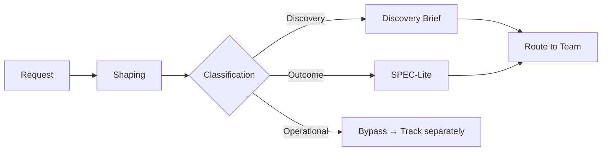

> Part II: How Work Enters | [← Previous](04-first-cycle.md) | [Next →](06-discovery-brief.md)

# Chapter 4: Intake, Classification & Shaping

> *Panel-reviewed: Meeting #4 (2026-03-19) — 7 agree, 4 modify-accept; updated Meeting #13 (execution leverage, Collapsed Mode)*
> **Read this**: PMs, Flow Coaches, anyone who triages incoming work.

---

## The Intake Pipeline

Every piece of work in FLOW passes through a pipeline before it reaches a team:

```
Request → Shaping → Classification → Routing → Cycle
```



**Request**: Something arrives — an idea, a customer complaint, a stakeholder demand, a regulatory requirement, a market signal, a technical debt item, or a **support pattern signal** (3+ users reporting the same issue is a Discovery hypothesis waiting to happen — see [Ch 16](17-roles.md), Signal Provider function).

**Shaping**: A senior person (PM, Tech Lead, or founder) frames the request — what's the boundary? What's the risk? What's NOT included? What question are we actually trying to answer?

**Classification**: Is this Discovery (we need to learn) or Outcome (we need to ship)? Is it new work or does it attach to an existing cycle?

**Routing**: Which team? Which bet does it trace to on the spine? If it doesn't trace — back to shaping or rejected.

**Cycle**: The team picks it up as a Discovery Brief or SPEC-Lite and begins working.

This pipeline can take 5 minutes (solo founder thinking in the shower) or 5 days (enterprise intake review with cross-team coordination). The steps are the same. The formality scales.

---

## Shaping: The Strategic Framing Activity

Shaping is what happens between "someone had an idea" and "the team starts working." It's the quality filter that prevents teams from receiving vague, unbounded, or strategically disconnected work.

### What Shaping Is

Shaping answers three questions:
1. **What's the boundary?** What's in scope and what's explicitly NOT in scope?
2. **Where's the risk?** What could go wrong? What's the biggest unknown?
3. **What mode does this need?** Is the primary risk building wrong (Discovery) or failing to ship (Outcome)?

### What Shaping Is NOT

- It's not writing a full Discovery Brief or SPEC-Lite (those come after classification)
- It's not solution design (how to build it)
- It's not estimation (how long it takes)
- It's not a committee activity (one or two people shape, the team executes)

### Who Shapes

Shaping requires strategic context and experience. Typically:
- **Solo founders**: You shape everything yourself. It's the 10 minutes of thinking before you start coding.
- **Small teams**: The PM shapes, sometimes with the Tech Lead.
- **Enterprise**: PMs and product directors shape. In Shape Up, "shapers" are explicitly senior people with both business and technical context.
- **Agency**: The PM shapes internal work. Client-facing shaping happens in discovery workshops (a billable activity — typically $2K-5K for a half-day workshop producing 3-5 shaped bets with boundaries and risks identified).
- **Government**: Shaping is the "Pre-Project Analysis" or "Feasibility Assessment" — a formal, funded activity with documented deliverables.

### Shaped vs. Unshaped Work

| | Unshaped | Shaped |
|---|---------|--------|
| Request | "We need a loyalty program" | "We believe repeat customers will increase 15% if we add a points system to the checkout flow. Out of scope: tiered rewards, partner integrations, gamification. Key risk: will users notice the points display?" |
| Result | Team spends 2 weeks asking "what do you actually want?" | Team immediately writes a Discovery Brief or SPEC-Lite |

The difference is not detail — it's BOUNDARIES. Shaped work has clear edges. Unshaped work is a fog.

---

## Classification: Discovery or Outcome?

Once work is shaped, apply the mode decision from [Chapter 2](02-mental-model.md):

> "Is the primary risk that we build the wrong thing, or that we fail to ship the right thing?"

**Discovery**: We don't know if the problem is real, the solution is right, or the approach will work. → Write a Discovery Brief ([Chapter 5](06-discovery-brief.md)).

**Outcome**: We have evidence. The problem is validated. The approach is defined. → Write a SPEC-Lite ([Chapter 8](09-spec-lite.md)).

**Both**: Split the work. Known parts → Outcome. Unknown parts → Discovery. They run in parallel (see mode relationship patterns, [Chapter 2](02-mental-model.md)).

**Neither**: It's operational work (incident, bug, maintenance). Bypass the spine AND skip Discovery/Outcome gates (D1-D3, O1-O5). Track separately. If operational work consistently exceeds 20% of capacity, that's a signal worth investigating as a bet ([Chapter 3](03-decision-spine.md)).

### Classification Questions

Use these to determine the mode:

1. Do we have evidence that users want this? (No → Discovery)
2. Have we tested the approach before? (No → Discovery)
3. Can we define a target metric right now? (No → Discovery)
4. Is the main risk execution, not direction? (Yes → Outcome)
5. Has someone shaped this with clear boundaries? (No → back to shaping)

---

## Intake Authority

Not everyone should be able to inject work into the system at every priority level. Without intake governance, whoever shouts loudest gets their work done first.

### The Intake Authority Matrix

| Request Source | Can Inject? | Priority Rights | Classification Authority |
|---------------|-------------|-----------------|------------------------|
| CEO / Executive | Yes | Can request urgent, but PM classifies mode | PM recommends, executive decides priority |
| PM / Product Lead | Yes | Full priority and classification rights | PM |
| Engineering / Tech Lead | Yes (tech debt, incidents) | Operational priority | PM classifies, Tech Lead advises |
| Customer / Sales | Via PM only | PM triages and prioritizes | PM |
| Regulatory / Legal | Yes | Compliance work is auto-high priority | PM classifies, Legal confirms urgency |
| Partners | Via PM only | PM evaluates against spine | PM |

The key principle: **anyone can REQUEST work. Only the PM CLASSIFIES it.** This prevents the CEO from bypassing Discovery by declaring something "Outcome — just build it."

### Redirection, Not Rejection

You don't say "no" to the CEO. You redirect:

*"I've classified this as Discovery. Based on the evidence we have — which is [what the CEO told you] — I'd recommend a 2-week experiment to validate [specific hypothesis]. The earliest start date given our current WIP is [date]. If the experiment validates the hypothesis, we'll move to Outcome immediately."*

That's not rejection. It's professional intake. The CEO gets a timeline, a plan, and evidence that you're taking their request seriously. The team gets protection from building blindly.

---

## Routing

Once classified, work routes to a team and traces to a spine mapping:

1. **Spine check**: Does this trace to an active bet? If not, can we create a new bet under an existing strategy? If not, it's either off-strategy (rejected) or signals a strategy gap (escalate).

2. **Team assignment**: Which team has the domain expertise and capacity? Check WIP limits ([Chapter 12](13-wip-limits.md)) before assigning. **Consider execution leverage**: high-leverage teams (with agentic tooling) can potentially take on more experimental work because the cost of a failed experiment is lower.

3. **Priority**: Where does this sit relative to active cycles? Does it displace something, queue behind it, or run in parallel?

### Handling Urgent Requests

Some requests bypass the full pipeline:
- **P0 incidents**: Go directly to the team. Spine check happens retroactively.
- **Regulatory deadlines**: Auto-classified as high priority. PM still classifies mode.
- **CEO escalations**: PM classifies and routes within 24 hours. No multi-week queuing.

The principle: urgency bypasses TIMING, not CLASSIFICATION. Even urgent work gets classified as Discovery or Outcome. Even urgent work needs a kill condition.

---

## The Intake Ritual

Intake can be continuous (solo founders, small teams) or batched (enterprise, agency):

| Context | Intake Cadence | Format |
|---------|---------------|--------|
| Solo founder | Continuous — items go into "Now/Next/Later" as they arrive | Mental classification in real-time |
| Small team (3-15) | Daily async or twice-weekly 15-min sync | PM reviews incoming, classifies, routes |
| Enterprise (30+) | Weekly 30-min Intake Review meeting | PM presents shaped items, team discusses classification |
| Agency | Per-client as requests arrive + weekly internal triage | Client-facing intake is relationship management; internal intake is classification |
| Government | Monthly programmatic intake + weekly project intake | Formal submission → review → approval → classification |

---

### Collapsed Mode: When Building IS the Experiment

When builds are cheap, default more aggressively to Discovery mode. If building an experiment costs less than the meeting to discuss whether to build it, just build it and measure. This is the **Collapsed Mode** — building IS the experiment. The intake artifact for Collapsed Mode is a **Micro-SPEC**: a lightweight version of the SPEC-Lite that captures just the hypothesis, target metric, kill condition, and observation floor. No Build Contract needed — the build is the experiment. Collapsed Mode is valid when: (1) the build cost is under ~4 hours of agent-assisted work, (2) the kill condition is measurable, and (3) rollback is trivial.

---

*Sidebars: Solo (your Notion inbox IS your intake — just add mode tags), Agency (client intake is a sales activity; internal intake is operational — bill for shaping workshops), Enterprise (multi-team intake needs a Technical Program Manager to coordinate cross-team routing)*

---

*Next: [Chapter 5 — The Discovery Brief →](06-discovery-brief.md)*
