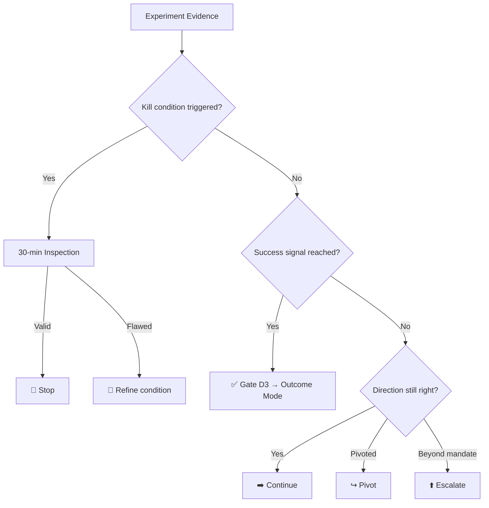

> Part III: Discovery Mode | [← Previous](07-experiments.md) | [Next →](09-spec-lite.md)

# Chapter 7: Discovery Decisions & Gates

> *Panel-reviewed: Meeting #4 (2026-03-19) — 7 agree, 4 modify-accept*
> *Updated: Meeting #14 — Kill Condition Enforcement*
> **Read this**: PMs, Flow Coaches, anyone making Continue/Refine/Pivot/Stop/Escalate decisions.

---

## Five Outcomes

When an experiment completes, the team reviews the evidence and makes one of five decisions:



### 1. Continue
**"The evidence is promising but incomplete. Run another experiment."**

The kill condition wasn't triggered, but the Success Signal ([Chapter 5](06-discovery-brief.md)) wasn't reached either. The hypothesis is in a grey zone — not invalidated, not validated. More data is needed. The team designs a follow-up experiment — typically at a higher fidelity level (e.g., conversations validated the problem; now test the solution concept with a mockup).

*Guardrail*: Continuing requires a NEW experiment design, not "let's keep doing the same thing." If two experiments produce inconclusive results, consider whether the hypothesis is too vague to test.

### 2. Refine
**"The direction is right, but the hypothesis needs adjustment."**

The experiment revealed that the problem exists but isn't exactly what you thought. The hypothesis needs refinement. "Nurses don't struggle with scheduling — they struggle with SWAP REQUESTS specifically."

*Action*: Revise the Discovery Brief with the refined hypothesis. Run a targeted experiment on the refined scope. This is narrowing, not pivoting.

### 3. Pivot
**"The problem is real, but our approach is wrong. Change direction significantly."**

The problem is validated but the solution direction isn't. Or: the problem is different from what you expected but equally or more important. "Nurses don't need a scheduling tool — they need a notification system that replaces their WhatsApp groups."

*Action*: Write a NEW Discovery Brief for the pivoted direction. The old Brief is archived with learnings. The pivot may change the bet on the Decision Spine.

### 4. Stop
**"The hypothesis is invalidated. Kill this work."**

The kill condition was met. The problem isn't real, isn't big enough, or isn't solvable with our current resources. This is not failure — it's success. You learned something valuable without building something nobody wants.

*Action*: Archive the Discovery Brief and Experiment Log. Document what was learned. Free the team's capacity for new work. Celebrate the kill — it saved real resources.

> **Kill Condition Enforcement Mode (Meeting #14)**: When a kill condition triggers, the **default is KILL**. The 30-minute inspection exists to check whether the data was valid — not to find reasons to continue. The burden of proof is on continuing, not on killing. If the data is valid and the condition was met, the work stops. Period. Teams at Maturity Level L2+ ([Chapter 2](02-mental-model.md)) enforce this strictly: triggered = killed unless the inspection reveals a flaw in the measurement itself (bad data, instrument error, unrepresentative sample). "But we're so close" is not a valid inspection finding.

### 5. Escalate
**"Discovery revealed something bigger than our mandate."**

The problem is real, but solving it requires authority, resources, or decisions beyond the team's scope. "We discovered this requires a regulatory change." "We discovered this needs a business model decision." "We discovered the scope is 10x what we estimated — leadership needs to decide."

*Action*: Document the discovery findings. Present to the appropriate decision authority (leadership, client, board, regulator). The work pauses until re-scoped at the higher level. The bet on the spine may need to be revised.

*When to escalate vs. when to stop*: Escalate when the PROBLEM is real but the SOLUTION is beyond your reach. Stop when the problem itself is invalidated or not worth pursuing.

---

## Gate D3: Mode Switch — Is There Enough Evidence?

Gate D3 is the transition point from Discovery to Outcome. It asks: **"Do we have enough evidence to start building?"**

### D3 Checklist

- [ ] **Problem is validated.** At least one experiment has confirmed the problem exists for the target users. This is not opinion — it's evidence.
- [ ] **Hypothesis is refined.** If the original hypothesis was wrong, you pivoted or refined. The current hypothesis reflects what you actually learned.
- [ ] **Solution direction is clear.** You know WHAT to build (at a high level). You don't need every detail — but you need the direction.
- [ ] **Kill condition for Outcome is definable.** You can articulate what success looks like as a measurable metric. If you can't define a metric, you're not ready for Outcome mode.
- [ ] **The team is ready.** Discovery may have been a PM-driven activity. Outcome requires the full team. Are engineering, design, and QA available?
- [ ] **The bet still traces.** Check the spine. Is the strategy this bet serves still active? If strategy shifted during Discovery, the bet may no longer matter.

### Mode Transition Formality

The formality of Gate D3 depends on context (from [Chapter 2](02-mental-model.md)'s spectrum):

| Context | D3 Formality |
|---------|-------------|
| **Solo founder** | Mental check. "Do I have enough evidence? Yes? Start building." 30 seconds. |
| **Small team** | PM presents evidence to the team. 15-minute discussion. Team agrees to switch. |
| **Mid-size team** | PM presents evidence to product leadership. Evidence reviewed. Mode switch approved. |
| **Enterprise** | PM presents evidence to governance body. Formal review with documentation. Approval recorded. |
| **Government** | Formal feasibility report submitted. Board/ministerial review. Documented approval. May require procurement process for Outcome resources. |
| **Agency** | PM presents Discovery findings to client. Client approves: "proceed to building" or "investigate further." Budget approval may coincide. |

---

## The Discovery Review Ritual

A periodic check on all active Discovery cycles. The rhythm depends on experiment duration:

| Context | Cadence | Format |
|---------|---------|--------|
| Solo founder | Continuous — review as experiments complete | Self-reflection: "What did I learn? What's next?" |
| Small team | Weekly 30-min sync | PM presents experiment results per cycle. Team decides: Continue, Refine, Pivot, Stop, Escalate |
| Enterprise | Bi-weekly or monthly (for long experiments) | PM presents to product leadership. Portfolio view of all active Discovery cycles |
| Hardware | Monthly (experiments take weeks-months) | Technical and business review of experiment results |
| Government | Monthly with formal minutes | Program-level review with documented decisions |

### What Happens in a Discovery Review

1. **For each active Discovery cycle**: PM presents experiment results (from the Experiment Log)
2. **Team discusses**: Does the evidence support the hypothesis? Is the kill condition met?
3. **Decision**: Continue, Refine, Pivot, Stop, or Escalate
4. **Action assignment**: Next experiment, revised Brief, or archival
5. **WIP check**: Are we carrying too many concurrent Discovery cycles? (See [Chapter 12](13-wip-limits.md))

### When to Skip the Ritual

- If only one Discovery cycle is active and the PM has the authority to decide — just decide. Don't hold a meeting for one item.
- If experiments are still running and no data is available — skip until data arrives. Don't review "still waiting."

---

## Archiving Learnings

When a Discovery cycle ends (Stop, or transition to Outcome via D3), archive the learnings:

### What to Archive

1. **The final Discovery Brief** — with any refinements applied
2. **All Experiment Log entries** — the complete record of what was tested
3. **The decision and reasoning** — why Continue/Refine/Pivot/Stop/Escalate
4. **Surprises** — what was unexpected? This is the most valuable learning.
5. **Transferable insights** — learnings that apply beyond this specific hypothesis

### Where to Archive

In the Learning Archive ([Chapter 11](12-outcome-decisions.md) covers the shared archive for both Discovery and Outcome cycles). The archive should be searchable — the next person with a similar hypothesis should find your work before running their own experiment.

### Why Archiving Matters

Teams without archives re-run experiments that have already been answered. "Should we build a mobile app?" might have been investigated 18 months ago — and killed. Without the archive, the next PM proposes the same thing, runs the same experiments, reaches the same conclusion. The archive turns individual learning into institutional memory.

---

*Sidebars:*

*Agency — Discovery Phase Report template: When Discovery concludes, the client needs a deliverable — not the internal Brief, but a client-facing report. Structure:*

```
DISCOVERY PHASE REPORT — [Client Name] — [Date]

1. OBJECTIVE: What we investigated and why
2. METHODOLOGY: What experiments we ran (interviews, prototypes, analysis)
3. KEY FINDINGS: What we learned (with data)
4. RECOMMENDATION: Proceed to build / Pivot direction / Stop
5. PROPOSED SCOPE: If proceeding — high-level scope for the Outcome phase
6. INVESTMENT: Estimated effort and cost for the Outcome phase
```

*This is the $10K-20K deliverable. The client pays for LEARNING — this report is the evidence of what was learned and the professional recommendation based on it.*

*Agency: When the client wants to skip Discovery — "just build what I asked for" — the PM has three options: (1) Educate: show examples of Discovery saving money. (2) Embed: run a lightweight Discovery within the first sprint without calling it "Discovery" — just smart requirements gathering. (3) Accept: if the client insists and has strong domain knowledge, accept the risk and document it. Some clients DO know what they want. Don't be dogmatic.*

*Enterprise: Discovery decisions in risk-averse cultures. The biggest danger is that "Stop" becomes stigmatized. If killing a Discovery cycle hurts someone's career, nobody will write honest kill conditions. Leadership must explicitly celebrate stops: "The team saved us $200K by proving this wasn't worth building." Make killing a KPI, not a punishment.*

---

*Next: [Chapter 8 — SPEC-Lite →](09-spec-lite.md)*
