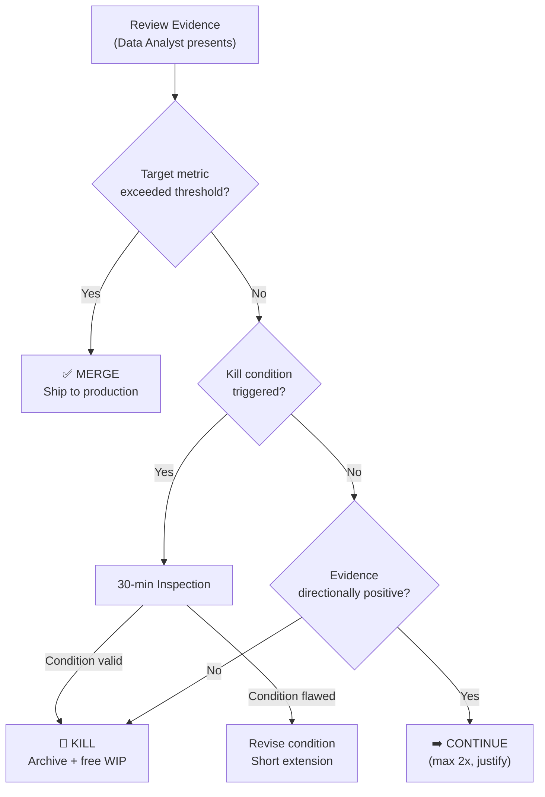

> Part IV: Outcome Mode | [← Previous](11-execution.md) | [Next →](13-wip-limits.md)

# Chapter 11: Outcome Decisions & Gates

> *Panel-reviewed: Meeting #5 (2026-03-19), updated Meeting #13 (Judgment Fatigue, Observation Floor)*
> *Updated: Meeting #14 — Kill Condition Enforcement, Judgment Fatigue Interaction*
> **Read this**: PMs, Data Analysts, Flow Coaches, Leadership. The most important ritual in FLOW.

---

## The Kill/Merge Meeting

The Kill/Merge meeting is **the most important ritual in FLOW**. It's where the team looks at evidence and makes one of three decisions for each active Outcome cycle: Kill it, Merge it into production, or Continue it with justification.

This is not a status update. It's not a demo. It's a **decision meeting** driven by data, not opinion. The **Data Analyst** (Evidence Interpreter — [Ch 16](17-roles.md)) presents the evidence. The **Compliance Officer** (Gate Advisor — [Ch 16](17-roles.md)) advises on regulatory implications. The PM facilitates the decision.

### Three Outcomes

#### Kill
**"The evidence says this isn't working. Stop."**

The kill condition was triggered (or the 30-minute inspection confirmed it should trigger). The work stops. The team archives the learnings, frees capacity, and moves to the next bet.

Killing is not failure. Killing is the methodology WORKING. The team invested a bounded amount of time, measured the result, and made an evidence-based decision to stop before wasting more resources.

**Kill Condition Enforcement (Meeting #14)**: When a kill condition triggers in Outcome mode, the **default is KILL**. This is the strongest enforcement point in all of FLOW — Outcome cycles have consumed real resources (engineering time, infrastructure, user exposure). The 30-minute inspection validates the data, not the team's desire to continue. At Maturity Level L2+ ([Chapter 2](02-mental-model.md)), a triggered kill condition that passes inspection results in immediate termination. The only valid inspection findings that override a kill: measurement instrument was broken, data was corrupted, or the sample was provably unrepresentative. "We're close to the threshold" is not a valid override — close is still triggered.

**What to do after a kill:**
1. Run the 30-minute kill condition inspection ([Chapter 1](01-why-flow.md)) — confirm the condition is valid
2. Archive the SPEC-Lite, Build Contract, and metrics dashboard
3. Document what was learned in the Learning Archive
4. Free the team's WIP slot ([Chapter 12](13-wip-limits.md)) — this capacity is now available
5. Celebrate. Seriously. The team saved the organization from a bad investment

#### Merge
**"The evidence says this is working. Ship it to production."**

The target metric met or exceeded the threshold. The feature is ready for full production. The team ships, monitors post-merge ([Chapter 14](15-production-readiness.md)), and archives the cycle.

**What to do after a merge:**
1. Verify Production Readiness ([Chapter 14](15-production-readiness.md)) — feature flags removed, monitoring in place
2. Archive the SPEC-Lite, Build Contract, and final metrics
3. Document the outcome in the Learning Archive
4. Free the team's WIP slot
5. Communicate the win — stakeholders, leadership, users

#### Continue
**"The evidence is inconclusive. Extend the cycle with justification."**

The kill condition wasn't triggered, but the target metric hasn't been met either. The team believes more time will show results — but they must justify WHY and set a new, shorter deadline.

**Continue is the dangerous option.** It's where zombie cycles are born. Every Continue must include:
1. **Why continue?** Specific evidence that the approach is directionally correct
2. **What will change?** What the team will do differently in the extension
3. **New deadline**: Shorter than the original cycle (maximum: 50% extension)
4. **Revised kill condition**: Same or stricter, never looser
5. **Maximum continues**: A cycle can be continued at most TWICE. After two continues, the only options are Kill or Merge. No third extension.

---

## Evidence-Based Decisions

The Kill/Merge decision is driven by the dashboard ([Chapter 10](11-execution.md)), not by gut feeling:

| Signal | Decision |
|--------|----------|
| Target metric exceeded threshold | **Merge** |
| Target metric trending toward threshold, needs more time | **Continue** (with justification) |
| Kill condition triggered | **Kill** (after 30-min inspection) |
| Adoption is zero after reasonable timeframe | **Kill** |
| Feature is technically broken (high error rates) | Fix first, then re-evaluate |
| Stakeholder loves it but metrics don't support it | **Kill** (metrics beat opinions) |
| Metrics are good but stakeholder hates it | **Merge** (metrics beat opinions) |

**Hardware-specific**: When the artifact physically fails (component failure, overheating, structural breakdown), that's not a metric signal — it's a hard stop. Investigate root cause. If the failure is in the design: Kill or redesign (new Discovery cycle on the failure mode). If the failure is in manufacturing quality: fix the process and re-test. Physical failure is the most expensive kind of evidence — document everything for the Learning Archive.

The last two rows are the hardest. FLOW is opinionated: **metrics beat opinions.** If the data says it's working, it ships — regardless of who dislikes it. If the data says it's not working, it dies — regardless of who champions it.

The exception: qualitative signals that metrics can't capture (safety concerns, brand risk, regulatory issues). These are valid reasons to override metrics. But they must be documented as overrides, not smuggled in as "we just don't feel good about it."

---

## Gate O5: Kill, Merge, or Continue?

Gate O5 is the formal decision point at the end of an Outcome cycle:

### O5 Checklist
- [ ] **Observability data is available.** Gate O4 passed. Dashboard has real data covering the measurement period.
- [ ] **Kill condition has been evaluated.** Either triggered or not — the team has checked.
- [ ] **Target metric has been measured.** The team knows the number, not just the feeling.
- [ ] **Decision is documented.** Kill, Merge, or Continue — with specific evidence cited.
- [ ] **If Continue: justification is written.** Why, what changes, new deadline, revised condition. Maximum 2 continues total.
- [ ] **Learning Archive entry is prepared.** What was learned, regardless of the decision.

### Kill/Merge Decision Record Template

```
Date: [YYYY-MM-DD]
Cycle: [Bet name — Cycle description]
SPEC-Lite: [link]
Build Contract: [link]

Target Metric: [metric name] = [actual value] vs [threshold]
Kill Condition: [condition] — [TRIGGERED / NOT TRIGGERED]

Decision: [KILL / MERGE / CONTINUE]
Evidence: [specific data points supporting the decision]
Dissent: [any disagreeing voices and their reasoning]

If CONTINUE:
  - Why: [justification]
  - What changes: [different approach]
  - New deadline: [date]
  - Revised kill condition: [same or stricter]
  - Continue count: [1st / 2nd — no 3rd allowed]

Next actions: [archive / ship / extend]
```

---

## The Outcome Review Ritual

A periodic check on all active Outcome cycles — not a Kill/Merge decision (that's a separate meeting), but a progress check:

| Context | Cadence | Format |
|---------|---------|--------|
| Solo founder | Continuous — check metrics daily | Self: "Is the metric moving?" |
| Small team | Weekly 30-min sync | PM presents dashboard per cycle. Flag issues early. |
| Enterprise | Bi-weekly | PM presents to product leadership. Portfolio view of all Outcome cycles. |
| Agency | Per-client cadence | Share progress with client. Prepare for client-gated Kill/Merge. |
| Government | Monthly with formal minutes | Program-level review with documented decisions. |

### Outcome Review vs. Kill/Merge

| | Outcome Review | Kill/Merge Meeting |
|---|---------------|-------------------|
| **Purpose** | Progress check | Decision point |
| **Question** | "Are we on track?" | "Kill, Merge, or Continue?" |
| **Output** | Flags, adjustments | Binding decision |
| **Frequency** | Weekly | End of cycle |
| **Authority** | Informational | Decision-making |

---

## The Learning Archive

Every completed cycle — whether Killed, Merged, or Continued-then-resolved — produces a Learning Archive entry. This is shared infrastructure between Discovery ([Chapter 7](08-discovery-decisions.md)) and Outcome:

### What to Archive

1. **The artifacts**: SPEC-Lite, Build Contract, final dashboard snapshot
2. **The decision**: Kill, Merge, or Continue — with evidence
3. **What surprised the team**: The most valuable learning is often unexpected
4. **What would the team do differently**: Process improvements for next cycle
5. **Transferable insights**: Learnings that apply beyond this specific cycle

### Why Archive Matters (Repeated from [Chapter 7](08-discovery-decisions.md), Intentionally)

Teams without archives re-run cycles that have already been resolved. "Should we build a loyalty program?" might have been attempted and killed 12 months ago. Without the archive, the next PM proposes the same thing, writes the same SPEC, runs the same cycle, reaches the same conclusion. The archive turns individual learning into institutional memory.

The archive should be searchable. Before writing a new SPEC-Lite, check: "Has anyone attempted this bet before? What happened?"

---

### Judgment Fatigue

> **Recommended maximum: ~5 major kill/merge decisions per team per week.** Batch decisions where possible. Judgment quality degrades with frequency — the fifth kill decision in a day is measurably worse than the first. If your portfolio has many active cycles reaching decision points simultaneously, stagger their timelines or batch Kill/Merge meetings to avoid decision fatigue.

> **Judgment Fatigue × Kill Enforcement Interaction (Meeting #14)**: When judgment fatigue is high, the temptation to rubber-stamp "Continue" increases — which directly undermines kill condition enforcement. If a team regularly faces 5+ decisions per week, they should (1) tighten kill conditions upfront so decisions are more binary, (2) batch decisions into a single weekly meeting where the team is fresh, and (3) track their kill-to-continue ratio — if it drops below 20% kills over a month, either the conditions are too generous or fatigue is eroding discipline.

### Observation Floor

> **Before any Kill/Merge decision, verify the observation window meets the minimum for your metric type.** Deciding to kill after 3 hours of data on a metric that needs 2 weeks is not evidence-based — it's impatience. Refer to the metric maturity table in [Chapter 18](19-organizational-change.md) for minimum observation periods by metric type. A kill condition can only be evaluated after the observation floor has passed. If the floor hasn't been met, the only valid decision is **Continue** (with the explicit reason: "observation floor not yet reached").

### Kill/Merge Decision Tree



---

### Sidebars

**Agency**: Kill conditions when the client is paying. The client paid $50K for this feature. The metrics say it's not working. Do you kill it? Yes — but reframe it. "The data shows the current approach isn't achieving the target. We recommend stopping this direction and redirecting the remaining budget toward [alternative]. This protects your investment." The client's money is better spent on something that works than on extending something that doesn't. Frame killing as fiduciary responsibility, not project failure.

**Enterprise**: Kill decisions in committee cultures. If killing requires committee approval, the Kill/Merge meeting becomes a recommendation meeting — the team recommends Kill with evidence, the committee decides. Document the recommendation and the committee's decision separately. If the committee overrides a Kill recommendation, document it as an override — "Committee chose to Continue despite evidence suggesting Kill. Rationale: [their stated reason]." This creates accountability.

**Platform**: For platform Outcome cycles, the Kill/Merge decision must consider downstream impact ([Chapter 3](03-decision-spine.md), cascade effect). Before killing a platform feature, notify dependent teams and assess the impact on their cycles. Before merging, ensure backward compatibility or provide migration paths.

---

*Next: [Chapter 12 — WIP Limits →](13-wip-limits.md)*
