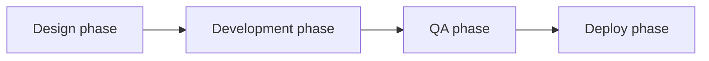

> Part VI: Adoption | [← Previous](16-regulated-environments.md) | [Next →](18-migration.md)

# Chapter 16: Roles & Team Topology

> *Panel-reviewed: Meeting #7, rewritten after Meeting #9, updated Meeting #13 (agentic role shifts) (2026-03-19)*
> *Updated: Meeting #14 — Domain Expert role*
> **Read this**: Everyone. Find YOUR function and understand your "From → To" transformation.

---

## FLOW Functions, Not Job Titles

FLOW defines roles by **function in the methodology**, not by job title. Your organization may use different titles — that's fine. What matters is that every function is covered.

There are **ten functions** in FLOW. In a solo team, one person covers all ten. In a large team, each function may map to a dedicated role or be shared across people.

---

## Quick Navigation

| # | Function | Traditional Title | Jump |
|---|----------|------------------|------|
| 1 | Decision Maker | Product Manager | [→](#1-decision-maker--product-manager) |
| 2 | Builder | Engineer | [→](#2-builder--engineer) |
| 3 | Experiment Architect | Designer | [→](#3-experiment-architect--designer) |
| 4 | Quality Intelligence Specialist | QA Engineer | [→](#4-quality-intelligence-specialist--qa-engineer) |
| 5 | Evidence Interpreter | Data Analyst | [→](#5-evidence-interpreter--data-analyst) |
| 6 | Evidence Infrastructure Owner | DevOps / SRE | [→](#6-evidence-infrastructure-owner--devops--sre) |
| 7 | Discovery Specialist | Business Analyst | [→](#7-discovery-specialist--business-analyst) |
| 8 | Process Guardian | Flow Coach | [→](#8-process-guardian--flow-coach) |
| 9 | Signal Provider | Customer Support / Field Ops | [→](#9-signal-provider--customer-support--field-operations) |
| 10 | Gate Advisor | Compliance / Legal / Regulatory | [→](#10-gate-advisor--compliance--legal--regulatory) |

---

## The Ten Functions

### 1. Decision Maker — Product Manager
**Owns**: The SPEC-Lite, the Discovery Brief, kill conditions, spine mapping, mode classification
**In Discovery**: Writes the Brief (or co-writes with BA), designs experiments with the team, evaluates evidence, makes mode switch decisions
**In Outcome**: Writes the SPEC-Lite, defines target metric and kill condition, runs Outcome Review, presents at Kill/Merge
**Key responsibility**: Deciding what to learn, what to build, and what to stop

### 2. Builder — Engineer
**Owns**: The Build Contract (co-owned with DevOps), implementation, code quality
**In Discovery**: Advises on experiment feasibility, builds prototypes when needed, estimates experiment cost
**In Outcome**: Implements features, writes the Build Contract, manages technical execution
**Key responsibility**: HOW to build — making decisions about architecture, implementation, and trade-offs during cycles

### 3. Experiment Architect — Designer
**Owns**: ALL experiment types (conversations, mockups, prototypes, usability tests), user experience across modes
**In Discovery**: Designs experiments — choosing the cheapest valid approach. The designer is the team's experiment specialist. Design is NOT a phase that happens before development.
**In Outcome**: Works ALONGSIDE engineers — validating UX during development, testing with users mid-cycle, iterating on the design as the build reveals realities
**Key responsibility**: Ensuring the team learns from users (Discovery) and builds for users (Outcome)

> **This function includes ALL creative disciplines** — visual artists, sound designers, motion designers, content writers, UX researchers. An artist's experiment: "Does this visual style resonate with our audience?" (kill condition: "If fewer than 60% of playtesters describe the art as [target emotion], try a different style"). A sound designer's experiment: "Does this audio feedback make the interaction feel responsive?" These are valid FLOW experiments with valid kill conditions.

> **Critical change from traditional roles**: Design is not a phase. In FLOW, the designer is embedded with the team throughout — not handing off mockups and walking away. There is no "design phase → development phase." There is continuous, simultaneous collaboration.

### 4. Quality Intelligence Specialist — QA Engineer
**Owns**: Quality signals, quality experiments, quality kill conditions

**From → To Transformation:**

| OLD (Process-Centric QA) | NEW (Decision-Centric QA) |
|--------------------------|---------------------------|
| Write test cases from requirements | Design quality experiments ("What would BREAK if this hypothesis is wrong?") |
| Execute manual test scripts | Define quality kill conditions ("If error rate exceeds X%, kill the cycle") |
| File detailed Jira tickets for every bug | For trivial bugs: let an AI agent fix them directly. For complex bugs: investigate root cause and flag as Discovery signal |
| Gate releases ("not approved for production") | Provide quality intelligence that feeds Kill/Merge decisions |
| Review completed work | Participate from Gate O2 (SPEC readiness) — shaping quality expectations before a line of code is written |

**In Discovery**: Designs quality experiments — "If we build this, what's most likely to break?" Stress-tests hypotheses from a quality perspective.
**In Outcome**: Defines quality kill conditions in the SPEC-Lite. Monitors quality metrics during the cycle. Presents quality evidence at Kill/Merge.
**AI IMPACT**: Agents handle routine regression testing, trivial bug fixes, and test generation. Human QA focuses on exploratory testing, edge cases, quality strategy, and interpreting quality signals.

> **The key shift**: QA stops being a gate at the end of a pipeline and becomes a quality intelligence partner embedded from the beginning. The question changes from "did we test everything?" to "what quality signal should trigger a kill?"

### 5. Evidence Interpreter — Data Analyst
**Owns**: Metric analysis, evidence compilation, Kill/Merge evidence presentation

**From → To Transformation:**

| OLD | NEW |
|-----|-----|
| Pull data when someone asks | Interpret evidence that drives decisions |
| Build dashboards on request | Design measurement frameworks that answer kill conditions |
| Report "the numbers" | Present "what the numbers MEAN" at Kill/Merge meetings |

**In Discovery**: Analyzes experiment results. Helps the PM interpret whether the Success Signal was reached or the Kill Condition was triggered.
**In Outcome**: Owns the target metric dashboard. Monitors trends. Compiles the evidence package for Kill/Merge. Presents: "Here's what the data says. Here's my interpretation."
**AI IMPACT**: Agents compile metrics automatically and flag anomalies. Human analysts focus on interpretation, causal analysis, and insight generation.

### 6. Evidence Infrastructure Owner — DevOps / SRE
**Owns**: Observability infrastructure, deployment pipelines, rollout execution, production monitoring

**From → To Transformation:**

| OLD | NEW |
|-----|-----|
| Maintain CI/CD pipelines | Build the evidence infrastructure that enables decisions |
| Deploy when told to | Co-own the Build Contract — specifically the rollout strategy and observability plan |
| Fight fires when production breaks | Design monitoring that catches kill condition triggers automatically |

**In Outcome**: Co-writes the Build Contract's observability plan and rollout strategy sections. Owns Gate O4 (observability in place). Executes production readiness ([Chapter 14](15-production-readiness.md)).
**AI IMPACT**: Agents handle deployment automation, alert triage, and routine incident response. Human DevOps focuses on observability design, reliability engineering, and production readiness strategy.

### 7. Discovery Specialist — Business Analyst
**Owns**: Stakeholder evidence gathering, hypothesis formulation, requirements-as-hypotheses

**From → To Transformation:**

| OLD | NEW |
|-----|-----|
| Gather requirements from stakeholders | Gather EVIDENCE from stakeholders — and challenge whether their requests are validated |
| Write BRDs (Business Requirements Documents) | Write Discovery Briefs — hypotheses, not requirements |
| Document what stakeholders want | Validate whether what stakeholders want is what users need |

**In Discovery**: Primary author of Discovery Briefs in enterprise contexts. Conducts stakeholder interviews as experiments. Synthesizes evidence for Gate D3 (mode switch).
**In Outcome**: Verifies that the SPEC-Lite's Problem field is grounded in real evidence, not assumed requirements.
**AI IMPACT**: Agents assist with desk research and competitive analysis. Human BAs focus on stakeholder conversations, hypothesis framing, and political navigation.

### 8. Process Guardian — Flow Coach
**Was**: Delivery Manager, Scrum Master, Project Manager, Project Coordinator, Agile Coach
**Owns**: Ritual facilitation, WIP enforcement, gate guardianship, methodology coaching

**From → To Transformation:**

| OLD | NEW |
|-----|-----|
| Track task progress in Jira | Facilitate DECISIONS at every ritual |
| Chase people for status updates | Enforce WIP limits — "We're at capacity. What are we willing to stop?" |
| Report velocity and burndown | Guard gates — "This Brief is missing a kill condition. It doesn't pass D1." |
| Remove impediments | Coach kill discipline — the hardest cultural change |

**Key responsibility**: The process works. Decisions happen. Nothing gets stuck. The Flow Coach does NOT make product decisions (PM) or technical decisions (Tech Lead).

**For Project Coordinators transitioning to Flow Coach**: This is a significant identity shift. You're moving from tracking work to facilitating decisions. The skills to develop: (1) Learning the gate checklists cold — you must know what passes and what doesn't. (2) Building the courage to block work that hasn't passed a gate. (3) Learning to ask "should we KILL this?" instead of "when will this be DONE?"

### 9. Signal Provider — Customer Support / Field Operations
**Owns**: User signals from real-world interactions, Discovery input, adoption monitoring

**From → To Transformation:**

| OLD | NEW |
|-----|-----|
| Respond to tickets reactively | Identify patterns in complaints that become Discovery hypotheses |
| Escalate bugs to engineering | Feed experiment design with real user language and real pain points |
| Maintain FAQ | Validate Discovery Briefs against real support data ("Do we actually see this problem in support?") |

**In Discovery**: Primary signal source. 3 users complaining about the same thing in a week? That's a hypothesis: "We believe users struggle with X because Y." Support writes the first draft of Discovery Briefs from pattern recognition.
**In Outcome**: Monitors adoption signals post-merge. "Users are calling about the new feature — here's what's confusing them." Feeds the Outcome Review.
**AI IMPACT**: Agents handle L1 support (routine questions, known issues, trivial fixes). Human support focuses on pattern recognition, edge case investigation, and Discovery signal generation.

**For Field Operations / Technicians**: When you visit a site, you're gathering Discovery data. Simple framework: "Are they using the product? How? What workarounds have they built? What do they complain about?" Report this back. You're the team's eyes and ears in the real world.

### 10. Gate Advisor — Compliance / Legal / Regulatory
**Owns**: Regulatory verification of FLOW artifacts, compliance readiness at gates

**From → To Transformation:**

| OLD | NEW |
|-----|-----|
| Review completed work after the fact | Advise at gate checkpoints BEFORE work begins |
| Block releases that fail compliance | Shape compliance into the process from Gate D2 (experiment permissions) through Gate O3 (Build Contract risks) |
| Write compliance reports from scratch | Verify that FLOW artifacts (Briefs, SPECs, Decision Records) satisfy audit requirements as-is |

**In Discovery**: Advise on experiment permissions (Gate D2). "This experiment involves real user data — here's what you need."
**In Outcome**: Review Build Contract for compliance risks (Gate O3). Participate in Kill/Merge as compliance voice.
**Post-merge**: Verify production readiness includes required compliance documentation ([Chapter 14](15-production-readiness.md)).
**AI IMPACT**: Agents check artifacts against compliance checklists. Human compliance focuses on judgment calls, regulatory interpretation, and audit readiness.

> **Note for enterprise/government**: Role transformation may require HR involvement — job descriptions, performance criteria, and sometimes union negotiation. This doesn't happen overnight. [Chapter 18](19-organizational-change.md) covers the organizational change management aspects. Start by introducing the FLOW functions as "additional responsibilities" before formally changing job titles.

---

## How Agentic Tooling Changes Roles

Agent tooling doesn't eliminate roles — it shifts their focus. Engineers move from writing code to reviewing and directing agent output. PMs move from waiting for builds to making more frequent judgment calls (see [Ch 11](12-outcome-decisions.md), Judgment Fatigue). Designers move from producing mockups to evaluating agent-generated prototypes against user needs. The **"Agent Operator" skill** — effectively directing AI agents, writing good prompts, reviewing agent output critically, knowing when to intervene — becomes valuable across all functions. This isn't a new role; it's a new competency layered onto existing roles. Teams that develop this skill first gain execution leverage ([Ch 4](05-intake.md)); teams that ignore it lose ground.

---

## The "No Handoffs" Principle

Traditional teams — even "Agile" ones — often run a hidden waterfall inside their iterations:

Each phase hands off to the next. The designer finishes and moves to the next project. QA waits until development is "done." DevOps deploys when QA approves.

**FLOW kills this hidden waterfall.**

In a FLOW cycle, all functions work **simultaneously**, not sequentially:

| Traditional (Sequential) | FLOW (Simultaneous) |
|--------------------------|---------------------|
| Designer creates mockups → hands off to dev | Designer and engineer work together — design evolves as engineering reveals technical realities |
| Developer codes → hands off to QA | QA defines quality conditions at SPEC stage and monitors quality DURING development, not after |
| QA tests → hands off to DevOps | DevOps instruments observability from day one, not after "QA approval" |
| DevOps deploys → done | Data analyst monitors metrics from first deployment, feeding Kill/Merge evidence continuously |

**For small teams (3-8)**: Everyone is in the same room (or channel). Conversation replaces handoffs. The designer sketches while the engineer codes. The QA person tests while development is ongoing.

**For larger teams (15+)**: The goal is "earlier involvement," not "everyone does everything." QA is involved from SPEC-Lite (Gate O2), not from "dev complete." DevOps is involved from Build Contract (Gate O3), not from "ready to deploy." Product Marketing is involved from SPEC-Lite, not from "ready to launch."

---

## Additional Functions (Context-Specific)

### Launch Intelligence Partner — Product Marketing
**In Outcome**: Participates from SPEC-Lite stage. Shapes positioning. Informs kill conditions with market context ("if the market shifted to competitor X's approach, this feature is dead"). Co-owns the rollout narrative in the Build Contract.
**Key shift**: From "marketing what we built" to "ensuring what we build is marketable."

### Domain Expert — Subject Matter Expert / Domain Validator (Meeting #14)
**Owns**: Domain-specific validation of experiments, hypotheses, and technical claims
**In Discovery**: Reviews experiment design at the optional Expert Review Gate (between D2 and D3). Validates: "Is this experiment measuring what you think it's measuring, given the domain's constraints?" Challenges assumptions the team may not have the expertise to question.
**In Outcome**: Reviews SPEC-Lite scope for domain-specific feasibility. Advises on kill condition thresholds based on domain benchmarks.
**Key shift**: From "we'll consult an expert if we get stuck" to "domain validation is a structured checkpoint."
**AI IMPACT**: An agent can serve as a Domain Expert via `/flow-expert` — a blueprint for domain-specific validators that challenge claims with domain knowledge, flag common domain pitfalls, and rate confidence in research findings. Human domain experts remain essential for novel or high-stakes domains.

This role is **optional** — teams declare whether they use Expert Review in their FLOW Configuration ([Chapter 14](14-rituals.md)). It is most valuable for medical, legal, financial, scientific, and regulatory domains where the team's general expertise may miss domain-specific risks.

### Knowledge Architect — Technical Writer / Knowledge Manager
**Owns**: Learning Archive maintenance, experiment log curation, institutional memory
**Key shift**: From "documenting what was built" to "curating what was learned."
**AI IMPACT**: Agents draft documentation from experiment logs and decision records. Human writers curate, edit, and ensure the archive is searchable and actionable.

### Architecture Advisor — Solution Architect
**In Discovery**: Evaluates technical feasibility of hypotheses at scale.
**In Outcome**: Co-owns the Build Contract's technical approach with the Tech Lead. Advises on platform implications and cross-system integration.

---

## RACI Matrix — Key FLOW Activities

Who is Responsible (R), Accountable (A), Consulted (C), or Informed (I)?

### Small Team (3-8 people)

| Activity | PM | Engineer | Designer | QA | Flow Coach |
|----------|-----|----------|----------|-----|------------|
| Discovery Brief | R,A | C | C | C | C (gate) |
| Experiment Design | C | C | R | C | — |
| Gate D1-D3 | R | C | C | — | A (checks) |
| SPEC-Lite | R,A | C | C | C | C (gate) |
| Build Contract | C | R,A | — | C | — |
| Gate O1-O5 | R | C | C | C | A (checks) |
| Kill/Merge Decision | A | C | C | C | R (facilitates) |
| WIP Enforcement | I | I | I | I | R,A |

### Enterprise (15+ people)

| Activity | PM | Engineer | Designer | QA | Data | DevOps | BA | Compliance | Flow Coach | Leadership |
|----------|-----|----------|----------|-----|------|--------|-----|-----------|------------|------------|
| Discovery Brief | A | C | C | C | C | — | R | C | C (gate) | I |
| Experiment Design | C | C | R | C | C | — | C | C (permission) | — | — |
| Gate D1-D3 | R | C | C | C | C | — | C | C | A (checks) | I (D3) |
| SPEC-Lite | R,A | C | C | C | C | — | C | C | C (gate) | I |
| Build Contract | C | R | — | C | — | R (obs+rollout) | — | C (risks) | — | — |
| Gate O1-O5 | R | C | C | C | C (evidence) | C (O4) | — | C (O3) | A (checks) | I (O5) |
| Kill/Merge Decision | R | C | C | C | R (presents) | I | — | C | A (facilitates) | A (approves) |
| WIP Enforcement | I | I | I | I | I | I | I | I | R,A | I |
| Spine Maintenance | R,A | — | — | — | — | — | C | — | C | A (approves) |

---

## How Roles Shift Between Modes

| Activity | Discovery | Outcome |
|----------|-----------|---------|
| **Leading** | PM + BA (hypothesis-driven) | PM + Engineering (joint execution) |
| **Experimenting** | Designer + QA (experiment design + quality experiments) | — |
| **Building** | Prototypes only (cheapest valid) | Engineering + Designer (simultaneous) |
| **Measuring** | Data Analyst + PM (experiment evidence) | Data Analyst + DevOps (observability dashboards) |
| **Deciding** | PM (mode switch at D3) | PM + full team (Kill/Merge) |
| **Guarding** | Flow Coach (D1-D3) + Compliance (D2 permissions) | Flow Coach (O1-O5) + Compliance (O3 risks) |
| **Signaling** | Support / Field Ops (real-world signals) | Support / Field Ops (adoption signals) |

---

## Team Types

FLOW applies differently depending on your team type (taxonomy from Team Topologies, Skelton & Pais 2019):

### Stream-Aligned Teams
A team aligned to a single stream of work. FLOW applies directly — all ten functions active.

### Platform Teams
Teams building platforms for other teams. Bets evaluated by downstream adoption. Kill conditions based on other teams' usage. DevOps function is especially critical — the platform IS infrastructure.

### Enabling Teams
Teams helping others adopt capabilities. Discovery mode dominant — the "product" is capability transfer. Kill condition: "If the target team isn't self-sufficient after N weeks."

### Complicated-Subsystem Teams
Teams owning complex subsystems. Outcome mode dominant. Discovery for redesigns or new technology integration. The Builder and Quality Intelligence functions are primary.

---

### Sidebars

**Solo**: You are all ten functions. The key is knowing which hat you're wearing. Most common mistake: wearing the Builder hat when you should wear the Decision Maker hat — coding before deciding whether to code. Quick self-check every morning: "Am I in Discovery or Outcome? What function should I prioritize today?"

**Agency**: Your project coordinator becomes a Flow Coach. This is a genuine career upgrade — from tracking tasks to facilitating decisions. Invest in training: the gate checklists, WIP enforcement, and especially kill discipline. The coordinator who can say "this cycle should be killed — here's the evidence" is more valuable than one who reports "this task is 60% complete."

---

*Next: [Chapter 17 — Migration to FLOW →](18-migration.md)*
